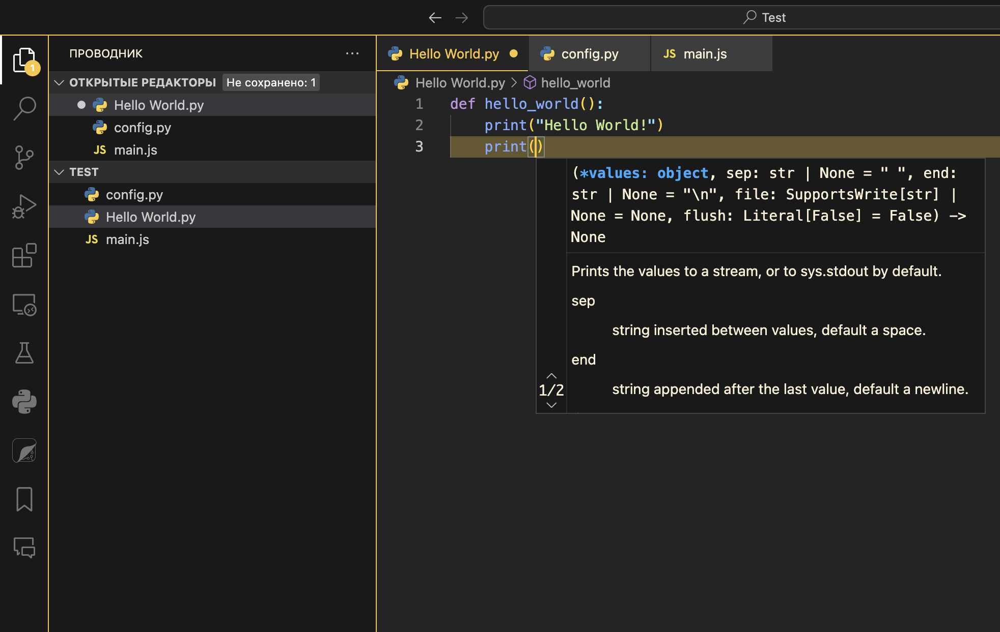

# BumbleBee Theme

## A dark-yellow theme for customizing your experience with VS Code!

### **Installation:**

To install the Bumble Bee theme in Visual Studio Code:
1. Open Visual Studio Code.
2. Press `Ctrl+Shift+P` (or `Cmd+Shift+P` on macOS) to open the Command Palette.
3. Type `ext install bumble-bee-theme` and press Enter.

Alternatively, you can find "Bumble Bee" in the Extensions Marketplace and click "Install."

### **Features**

- Bold color palette with high contrast for better readability.
- Custom syntax highlighting.
- Optimized for long coding sessions without eye strain.

### **Links**

* [GitHub Repository](https://github.com/Merrrish/bumble-bee-theme "Visit Repository")

### **License**

*MIT License*

### **Enjoy!**

